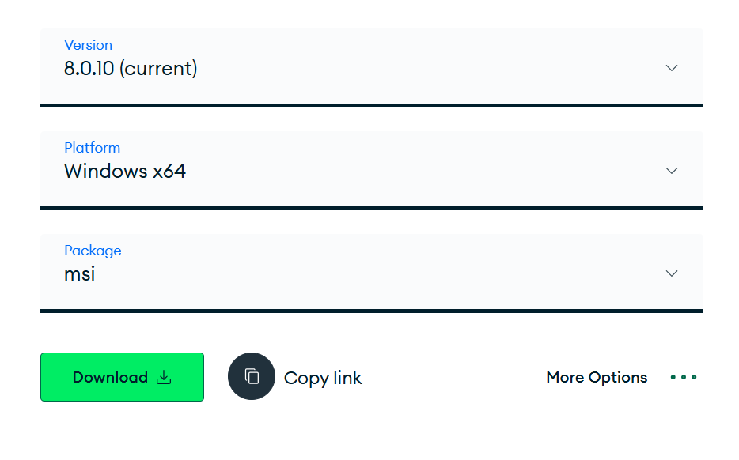

# Node.js + Express

1. Setup (Instal Dependencies)

```
npm init -y
npm install express cors
npm install nodemon --save-dev

```

2. create `server.js`

```
const express = require('express');
const cors = require('cors');
const app = express();

// Middleware
app.use(cors()); // Enable CORS
app.use(express.json()); // Parse JSON bodies

// Start server
const PORT = 5000;
app.listen(PORT, () => {
  console.log(`Server running on http://localhost:${PORT}`);
});

```

3. Update `package.json`

```
"scripts": {
  "start": "node server.js",
  "dev": "nodemon server.js"
}
```

4. Key Features

- CORS handling
- Request Body Parsing
- Endpoint Structure (get, post, put, delete)
- Error Handling
  - Validates required fields
  - Catches server errors with try-catch
  - Returns appropriate HTTP status codes:
    - 200 for success
    - 400 for client errors
    - 300 for directing 
    - 500 for server errors

5. Testing API

- Start the server `npm run dev`
- Test using CURL

```
curl -X POST http://localhost:5000/submit -H "Content-Type: application/json" -d "{\"name\":\"sineka\", \"email\":\"sine@gmail.com\", \"message\":\"mes\"}"

```

`curl -X GET http://localhost:5000/submissions -H "Content-Type: application/json"`

6. Set up Mongo db
- Download mongodb `https://www.mongodb.com/try/download/community`


- Then Install
- create a database and connect

7. Mongoose Library

- `npm install mongoose` to install mongoose
- Set up mongodb connection in server.js 

```
const mongoose = require("mongoose");

   mongoose.connect("mongodb://localhost:27017/feedbackDB", {
     useNewUrlParser: true,
     useUnifiedTopology: true
   })
   .then(() => console.log("Connected to MongoDB"))
   .catch((err) => console.error("MongoDB connection error:", err));
```
- create schema in Models directory

```
const mongoose = require("mongoose");

const feedbackSchema = new mongoose.Schema({
  name: String,
  email: String,
  message: String,
  date: { type: Date, default: Date.now }
});

const Feedback = mongoose.model("Feedback", feedbackSchema);
module.exports = Feedback;

```

